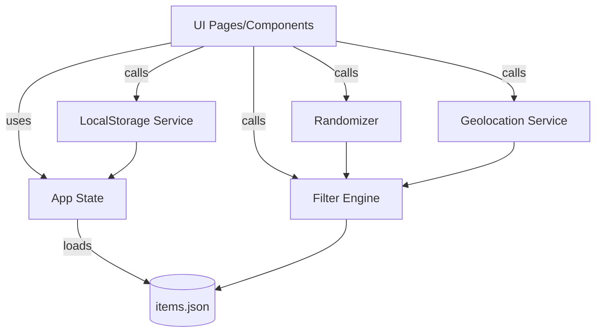

# what-to-eat-today · Design (Draft)

## 1. Overview
A mobile-first bilingual (ZH/EN) web app that suggests “what to eat today.” It runs fully client-side for the MVP. Users can:
- One-tap random recommendation subject to filters (cuisine/budget/distance/meal-time).
- Manage favorites and blacklist (localStorage, no login).
- Optionally enable geolocation to prioritize nearby options.

Primary targets: mobile browsers; deployable as static site. Future-proof to swap built-in dataset with external APIs.

## 2. Architecture
- Client-only SPA/SSR-ready: Recommend Next.js + TailwindCSS. MVP can run purely on the client; SSR optional.
- Data source: bundled JSON dataset (`/public/data/items.json`).
- Persistence: `localStorage` for preferences, favorites, blacklist, selected language.
- Geolocation: HTML5 Geolocation API (opt-in). Distance via Haversine.
- i18n: Simple key-based dictionary (ZH/EN) with runtime toggle.



## 3. Components and Interfaces

### 3.1 UI
- Home page: 
  - FilterBar (cuisine/budget/distance/time, language switch)
  - RandomButton
  - ResultCard (name, cuisine, price tier, distance if available, actions: favorite/blacklist, open link)
- Favorites page/view (optional in MVP-): list with un-favorite / blacklist
- Toast area for non-blocking errors (geolocation, storage)

### 3.2 Services
- DataService
  - `loadItems(): Promise<Item[]>` – loads `/public/data/items.json` (bundled, small)
- FilterService
  - `filter(items: Item[], filters: FilterState, geo?: Coordinates): Item[]`
- RandomService
  - `pickOne(items: Item[]): Item | null` – uniform random
- GeoService
  - `requestPermission(): Promise<Coordinates | null>` – asks user; returns null if denied
  - `distance(a: Coordinates, b: Coordinates): number` – meters (Haversine)
- StorageService (gracefully handles unavailable storage)
  - `get<T>(key: string, fallback: T): T`
  - `set<T>(key: string, value: T): void`
  - Keys: `favorites`, `blacklist`, `lang`, `filters`
- I18n
  - `t(key: string): string`
  - `setLang(lang: 'zh' | 'en')`

### 3.3 Events/Flows
- On load: load dataset -> init filters from storage -> render.
- On Random: compute eligible pool -> pickOne -> display -> allow actions.
- On Favorite/Blacklist: update storage -> update UI; blacklist excludes from pool.
- On Distance toggle: if enabled -> request geo -> store in memory -> re-filter.

## 4. Data Models (TypeScript)

```ts
export type PriceTier = 'low' | 'mid' | 'high'
export type MealTime = 'breakfast' | 'lunch' | 'dinner' | 'late'

export interface Coordinates { lat: number; lng: number }

export interface I18nLabel { zh: string; en: string }

export interface Item {
  id: string
  type: 'restaurant' | 'dish'
  name: I18nLabel
  cuisine: I18nLabel // display; may also keep a stable cuisine code
  cuisineCode?: string // e.g., 'sichuan', 'cantonese', 'japanese', 'thai', ...
  price: PriceTier
  geo?: Coordinates
  meals: MealTime[]
  link?: string // map or delivery link
}

export interface FilterState {
  cuisines: string[] // cuisineCode list
  price?: PriceTier
  distanceMeters?: number // undefined when disabled
  meal?: MealTime
}
```

Dataset file example (JSON array) fields must match `Item` above.

## 5. Algorithms and Rules
- Filtering pipeline (pure, side-effect free):
  1. Cuisine: include if `cuisineCode ∈ filters.cuisines` when non-empty
  2. Price: equal match when set
  3. Meal-time: include if `filters.meal ∈ item.meals` when set
  4. Distance: include if `item.geo` exists and `distance(user, item.geo) ≤ filters.distanceMeters`
  5. Exclusions: remove if `id ∈ blacklist`
- Random selection: uniform `Math.random()`; optional weighting by favorites (post-MVP).
- Distance: Haversine with Earth radius 6371000m.

## 6. Error Handling
- Geolocation denied/unavailable: show toast, disable distance control; preserve other filters.
- Storage blocked (Safari private mode, policies): fall back to in-memory map; show one-time notice.
- Empty results: show empty state with quick actions to relax filters (clear budget/distance, broaden cuisine).
- Dataset load failure: show error and retry action; ship a minimal inline fallback list if needed.

## 7. i18n
- Keyed dictionary object, e.g., `copy.random`, `copy.filters.cuisine`, `cuisine.sichuan`, etc.
- Persist chosen language in `localStorage: lang`.
- Data labels (`Item.name`) already bilingual; UI strings from dictionary.

## 8. Accessibility and UX
- Buttons with ARIA labels; keyboard focus states.
- Color contrast >= WCAG AA; avoid color-only indicators.
- Touch-friendly hit areas (min 44px).

## 9. Performance
- Dataset budget < 50KB in MVP.
- Avoid heavy dependencies; tree-shake where possible.
- Instant filtering in-memory; no network roundtrips.

## 10. Testing Strategy
- Unit tests
  - FilterService: all filter branches, blacklist, edge cases (no geo, no matches).
  - GeoService: distance math with known coordinates.
  - StorageService: simulate storage unavailable.
- Integration tests
  - From filters to random result determinism (seed Math.random in tests where needed).
- E2E (optional): Playwright to click through mobile viewport, language toggle, geolocation mocked.

## 11. Security & Privacy
- No login; no backend calls in MVP.
- Request geolocation only on explicit user action; don’t persist coordinates.
- Links to external pages (maps/delivery) open in new tab with `rel="noopener"`.

## 12. Open Questions (to confirm before build)
- Price tiers exact thresholds (¥ or $ ranges)? Default to symbolic tiers for MVP.
- Distance options: 500m / 1km / 3km? Default set: 500/1000/3000.
- Minimal dataset entries: target 20–30 to start.
- Do we want a simple favorites list view in MVP or as next step?

## 13. Implementation Notes
- Directory hints (if using Next.js):
  - `app/` or `pages/`: `index` (home)
  - `public/data/items.json`
  - `src/services/` for data/filter/random/geo/storage/i18n
  - `src/components/` for FilterBar, ResultCard, LangToggle
- Progressive enhancement: if JS disabled, page shows a static tip to enable JS (acceptable for MVP).

